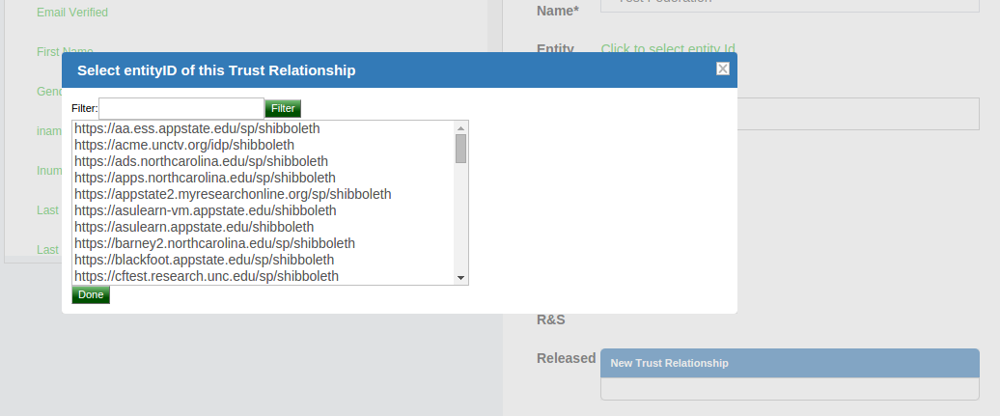

## 2.1 Outbound SAML
Outbound SAML can also be called SP-initiated Single Sign On (SSO) or traditional SAML. In an outbound SAML transaction, the SP redirects the user to the designated Identity Provider (IDP) for authentication and authorization. The IDP will ask for the username and password for the user and up on successful authentication, the user is sent back to the SP logged in. The requirement for the IDP is a trust relationship (TR) set up beforehand with the SP. The next section covers how to set up a TR in Gluu Server.

!!! Note
    For any SAML transaction, a trust relationship must be created with the IDP.

### 2.1.1 Trust Relationship Requirements
Trust Relationship requires the infomation listed below.

- [Metadata of website](#metadata-of-website)
- [Required attribute of website](#required-attribute-of-website)
- [SSO testing endpoint of website](#sso-testing-endpoint-of-website)

#### 2.1.1.1 Metadata of the SP
Metadata is a XML file which has configuration data used to provision any website (SP) or IDP (Gluu Server) to communicate with each other. It is interchangeable between the IDP and the SP.

Websites (SP) can provide metadata via URL or as a separate file.

#### 2.1.1.2 Required Attributes
Every organization has their own policy to release/share attributes with
any IDP or SP. The oxTrust GUI supports both preconfigured and custom attribute
Release to the SP. The administrator only needs to click on the desired 
attribute and it will be released to the SP.

#### 2.1.1.3 SSO Testing Endpoint
Every website (SP) should have both a staging and a production URI
endpoint which can be checked for SSO, where the user will access to log
into that SP.

### 2.1.2 Create a Trust Relationship
* Go to SAML → Trust Relationships
* Click on “Add Relationship”


* A new page will appear. Here, as a Gluu Server administrator you need
  to provide all the information regarding the SP to establish Trust
  Relationship from Gluu Server.


* _Display Name_: Name of the Trust Relationship (it should be unique for every trust relationship)
* _Description_: Little description. Purpose and SSO link can be added here.
* _Metadata Type_: Depending on trusted party’s metadata (SP), there are four available types in Gluu Server
    * _File_: If SP has uploadable metadata in XML format, this option works best.
    * _URI_: If the metadata of SP has URI link and accessible from the internet, Gluu Server Administrator can use this option.
* _Released_: The attributes that are required for the SP must be in this pane. The required attributes can be selected from the left side pane with the heading “Release Additional Attributes”.
The TR is added by clicking on the `Add` button located in the lower left side of the page.

#### 2.1.2.1 Relying Party Configuration
The Relying Party must be configured for some SPs. The relying party configuration is accessible on the TR Creation page. The checkbox `Configure specific Relying Party` must be checked.


The checkbox will result in a link which can be accessed to configure relying party for the TR. The image below shows the relying party config panel from which the administrator can add the specific option.


#### 2.1.2.2 Federation Configuration
If the SP is part of any identity federation such as InCommon Federation, then the administrator must add the federation as a SP in Gluu Server. This will allow the administrator to add SPs under the federation easily from a TR. The requirement of a federation TR created using the general TR is a must. The example below shows an administrator adding a TR for InCommon Federation.


Once this is done, the SPs under the federation can be added by selecting the Federation from the `Federation Name` drop down menu and selecting the entity-id for the SP.



## 2.2 Inbound SAML
Gluu Server uses an open source product called Asimba to achieve inbound SAML. Asimba allows websites to use a single IDP for SSO even when the organization has multiple trusted IDPs. Please see the [Asimba website](http://www.asimba.org/site/) for more information.

Gluu Server is shipped with the SAML Script which simplifies the process of using SAML Proxy. The SAML proxy configuration is made easy from the oxTrust admin interface. This section provides a step-by-step method of configuring the proxy with two (2) IDPs and a single SP. The administrator can add multiple IDPs or SPs if required using the same method. However, it is mandatory that all the SPs and IDPs are connected to the Asimba server, or the IDP that has the Asimba module enabled.
i

### 2.2.1 Required Setup

|Setup hostname|Description|
|--------------|-----------|
|https://sp.gluu.org/protected/print.py|This is a shibboleth SP connected to _https://test.gluu.org_|
|https://test.gluu.org| This is a Gluu Server SAML IdP with Asimba|
|https://nest.gluu.org|This is a second Gluu Server SAML IdP connected to _https://test.gluu.org_ |


!!! Note
    Description of SAML Authentication Module is available here: https://github.com/GluuFederation/oxAuth/tree/master/Server/integrations/saml

#### 2.2.1.1 Specific Setup Details
The Gluu Server setup with the hostname `https://test.gluu.org` must be setup with Asimba. This is done by typing `yes` to the [setup script prompt](../installation-guide/setup_py.md).


### 2.2.2 Custom Script Configuration

!!! Note
    The configuration below is done in the Gluu Server with Asimba installed with the hostname `https://test.gluu.org`.

* Log into the oxTrust interface as `admin`

* Navigate to Configuration --> Manage Custom Scripts


* Select/Add `saml` script from `Person Authentication` tab


   - Name: saml
    - Description: Saml Authentication module
    - Programming Language: Python
    - Level: 1
    - Location Type: LDAP
    - Usage Type: Web
    - Custom property (key/value)
       - saml_deployment_type: enroll
       - saml_idp_sso_target_url: https://test.gluu.org/asimba/profiles/saml2/sso/web
       - saml_validate_response: false
       - asimba_entity_id: https://test.gluu.org/saml
       - asimba_saml_certificate_file: /etc/certs/saml.pem 
         - note: Deployer need to copy 'asimba.crt' in 'saml.pem' without the 'BEGIN CERTIFICATE' and 'END CERTIFICATE' tag. 
       - user_object_classes: eduPerson
       - saml_idp_attributes_mapping: { "attribute_name": ["attribute_name", "SAML2 URI"] } 
         - example: ```{"uid": ["uid", "urn:oid:0.9.2342.19200300.100.1.1"], "mail": ["mail", "urn:oid:0.9.2342.19200300.100.1.3"], "givenName": ["givenName", "urn:oid:2.5.4.42"], "sn": ["sn", "urn:oid:2.5.4.4"], "eduPersonPrincipalName": ["eduPersonPrincipalName", "urn:oid:1.3.6.1.4.1.5923.1.1.1.6"] } ```
       - enforce_uniqueness_attr_list: attribute1, attribute2
         - example: ```edupersonprincipalname, uid, mail, givenName```
       - saml_use_authn_context: false
       - saml_generate_name_id: true
    - Script: Please copy the [SAML Script](https://github.com/GluuFederation/oxAuth/blob/master/Server/integrations/saml/SamlExternalAuthenticator.py) from Github. 
    - Enabled: True


### 2.2.3 Adding IDP in Asimba Server

!!! Note
    The configuration below is done in the Gluu Server with Asimba installed with the hostname `https://test.gluu.org`.

* Log into the oxTrust interface

* Navigate to SAML --> Idp


* Click on 'Add IDP' button


* Fill up the form with the information below:
    
    * ID: The entityID of the remote ID/ADFS 

        - Example: `https:<hostname_of_gluu_server>/idp/shibboleth`  

    * Friendly Name: There is no particular format for this field, use anything 

    * Metadata URL: Keep it blank, we will upload metadata

    * Metadata Timeout: Keep it as it is. 

    * Metadata File: Download metadata of remote IDP/ADFS and upload that XML file. 
    
        - Example: The metadata for Gluu IdP can be downloaded using `wget -c https:<hostname_of_gluu_server>/idp/shibboleth`

    * Trust Certificate File: Grab the SAML cert from remote IDP/ADFS and upload that x509 certificate

        - Example: You will get the SAML certificate from Gluu Server's metadata link or available inside `/etc/certs/shibIDP.crt`

    * NameIDFormat: SAML2 URI nameID format if remote IDP is a Gluu Server otherwise ask for their nameID format.

        - Example: `urn:oasis:names:tc:SAML:2.0:nameid-format:transient'

    * Enabled: Yes

    * Send Scoping: Yes

    * AllowCreate: Yes

    * Disable SSO for IDP: No

    * ACS index: Yes

    * Send NameIDPolicy: Yes

    * Avoid Subject Confirmations: No


### 2.2.3 Adding SP Requestor in Asimba Server
* Log into oxTrust interface

* Navigate to SAML --> SP Requestor


* Click on 'Add SP Requestor'


* Please fill up the form with the information below:
     - Select parent SP Pool: requestorpool.1
     - ID: https://test.gluu.org/saml
     - Friendly Name: oxAuth SAML
     - Metadata URL: Not required
     - Metadata Timeout: -1
     - Metadata File: Create a SAML metadata like below and save it as 'saml_oxauth_metadata.xml'. Upload this metadata. 
     - Trust Certificate File: Not required
     - Properties: Not required
     - Enabled: Yes
     - Signing: No
     - metadata snippet: 
``` 
<md:EntityDescriptor xmlns:md="urn:oasis:names:tc:SAML:2.0:metadata" entityID="https://test.gluu.org/saml">
  <md:SPSSODescriptor protocolSupportEnumeration="urn:oasis:names:tc:SAML:2.0:protocol">
    <md:AssertionConsumerService Binding="urn:oasis:names:tc:SAML:2.0:bindings:HTTP-POST" Location="https://test.gluu.org/oxauth/postlogin" index="0"/>
  </md:SPSSODescriptor>
  <md:Organization>
    <md:OrganizationName xml:lang="en">Gluu</md:OrganizationName>
    <md:OrganizationDisplayName xml:lang="en">Gluu - Open Source Access Management</md:OrganizationDisplayName>
    <md:OrganizationURL xml:lang="en">http://www.gluu.org</md:OrganizationURL>
  </md:Organization>
  <md:ContactPerson contactType="technical">
    <md:GivenName>Administrator</md:GivenName>
    <md:EmailAddress>support@gluu.org</md:EmailAddress>
  </md:ContactPerson>
</md:EntityDescriptor> 
```


### 2.2.4 Trust Relationship 
!!! Note
    The configuration below is done in the Gluu Server with Asimba installed with the hostname `https://test.gluu.org`.

Create Trust relationships for all service provides which are included in SAML Proxy SSO workflow. In our test setup we created Trust relationship for remote SP which has entityID 'https://sp.gluu.org/shibboleth'. How to create Trust Relationship is available in [Section 2.1](#2.1-outbound-saml).

!!! Note
    The configuration below is done in the Gluu Server with Asimba installed with the hostname `https://nest.gluu.org`.

Log into the oxTrust inteface and follow the steps to add a new Trust Relationship.

  - Gluu Server's Asimba metadata can be achieved from 'https://test.gluu.org/asimba/profiles/saml2'
    - Download the metadata and use 'File' method to create Trust relationship
  - Relying Party Configuration: 'SAML2SSO' Profile 
![
    - example: 
        - includeAttributeStatement: Yes
        - assertionLifeTime: 300000
        - assertionProxyCount: 0
        - signResponses: conditional
        - signAssertions: never
        - signRequests: conditional
        - encryptAssertions: never
        - encryptNameIds: never
  - Attribute: Any attribute Service Providers require. Any kind of nameID from below list is mandatory. 
     - nameID: 
        - `nameIDFormat="urn:oasis:names:tc:SAML:1.1:nameid-format:unspecified"`
        - `nameIDFormat="urn:oasis:names:tc:SAML:2.0:nameid-format:transient"`
        - `nameIDFormat="urn:oasis:names:tc:SAML:1.1:nameid-format:emailAddress"`
     - How to create nameID in Gluu Server is available [here](https://gluu.org/docs/customize/attributes/#custom-nameid)

### 2.2.5 Test Asimba with SAML Proxy
Here is a quick video on how SAML Proxy SSO might look like. Here in this video we are using 'https://sp.gluu.org/protected/print.py' as our protected service provider link. After initiating the SSO, we are moved to Gluu Server's SAML Proxy discovery page ( https://test.gluu.org ). From there we selected 'Nest' as our desired authentication server. After succesful authentication we are landing to proctected resource. 

* [Youtube Video Link](https://youtu.be/YEyrOWJu0yo)


