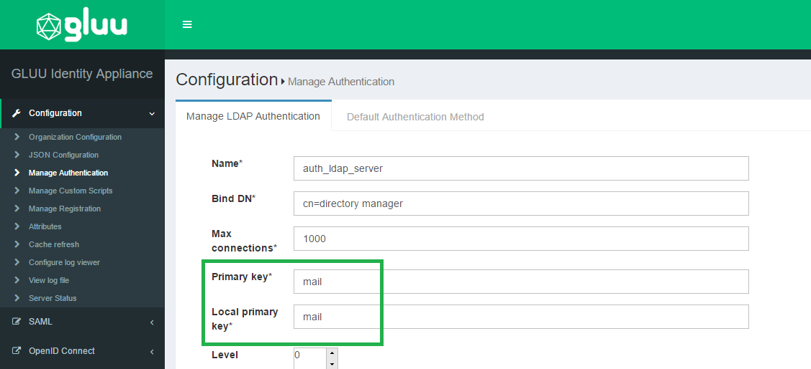

[TOC]
# General FAQ
## How to change the hostname/IP address/listening port of Gluu Server
It is not recommended to change the hostname or IP address or the listening port of any installed Gluu Server instance. The hostname and the IP address is used in many settings stored in LDAP configuration entries, Apache/Jetty configuration and into the custom authentication script. It is strongly recommended to use a fresh install in a new VM. 

!!! Note
    Please use static IP address with reverse proxy or load balancer or simple port forwarding.

## How to set the port to something other than 443
Ports other than 443 are not supported as the port is used by Apache Web Server. In theory, the change must reflect in the SAML and OpenID Connect metadata and still there might be errors.

!!! Note
    Please use a virtual ethernet interface and a different IP address on your server

## How to customize IDP to ask for Email instead of username

In oxTrust navigate to the Manage Authentication tab within the Configuration section. By default the Primary Key and Local Key are set to `uid`. Set those va    lues to `mail` and now your Gluu Server will expect email as the identifier instead of username.



Now you will want to update your IDP login page to display `Email Address` as the requested identifier. In order to do that you need to modify the `login.xhtm    l` file, which is located in `/opt/tomcat/webapps/oxauth/`. Insert `Email Address` as the value for `outputLabel`; this snippet is under the `dialog` class. S    ee the screenshot below.


## How to add additional roles to oxTrust and change permissions for existing ones
The additional role requires the implementation of dynamic rules in Jboss SEAM and then uitlize them in oxTrust as the available _manager_ and _user_ roles are defined within the `securit.drl` hard-coded into oxTrust. The file checks for the _maanger_ group membership and adds the role to the web context. This is currently out of the scope of support. 

!!! Warning
    oxTrust is a tool for administrators and it must nto be used as a user facing application.

# Troubleshooting Guide
## DNS names not resolving
It is possible that even after configuring everything there is a `DNS` resolve error in Gluu Server.
The reason is the `DNS` used inside the chroot container; the `dns` used by the container is the Google DNS servers 
and the `DNS` for the host OS is not used. Therefore to fix this issue:

- Change the DNS inside the container by editing the `/etc/resolv.conf` file and adding the DNS used by your organization

## DNS names not resolving!
It is possible that even after configuring everything there is a `DNS` resolve error in Gluu Server.
The reason is the `DNS` used inside the chroot container; the `dns` used by the container is the Google DNS servers 
and the `DNS` for the host OS is not used. Therefore to fix this issue:

- Change the DNS inside the container by editing the `/etc/resolv.conf` file and adding the DNS used by your organization

## Forgot the admin password! 
Gluu Server stores the admin password in the file `/install/community-edition-setup/setup.properties.last` under the
property `ldapPass`. Retrieve the data using the following command:

```
# grep ldapPass= /install/community-edition-setup/*.last
```

!!! Warning
    It is strongly recommended to remove the file from any production environment or encrypt the file

