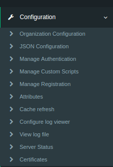
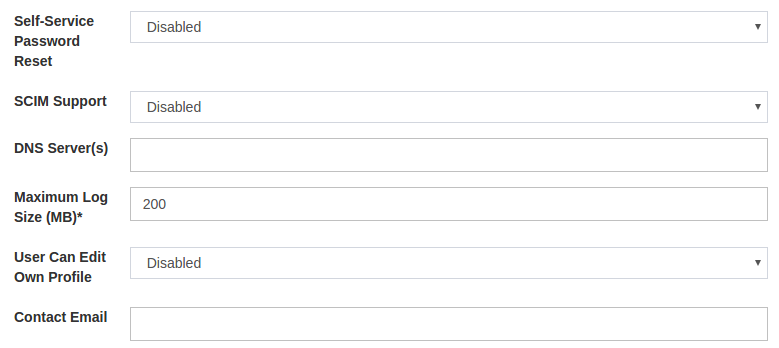
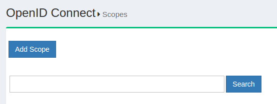

# Gluu Server Administrative Interface
The administration interface (oxTrust) is accessible from the `hostname` provided in the prompt from the setup script. After the installation is complete, log in to the web-based interface with the username `admin` and the `LDAP superuser` password. 

## Welcome Page
Upon login the administrator is taken to the oxTrust dashboard where some basic information about the VM/server is displayed. The version is shown on top followed by free memory and disk space. The health of the VM/server can also be determined from the dashboard. There is a photo icon on the upper right side of the page which can be used to navigate to the user profile page and log out of the Gluu Server.

The menu on the left side can be used to navigate the admin interface. The menu includes links to manage configuration, SAML, OpenID Connect, UMA, and users.

## Configuration

The configuration tab contians options to configure the Gluu Server. From this tab the administrator can manage authentication, registration, attributes, cache-refresh (LDAP synchronization), logs and more.

### Organization Configuration
There are three sections in the organization configuration page:  
   
- [System Configuration](#system-configuration)      
- [SMTP Server Configuration](#smtp-server-configuration)       
- [OxTrust Settings](#oxtrust-settings).       

These sections are detailed below with screenshots.

#### System Configuration

- Self-Service Password Reset: the admin can enable or disable the ability for users to reset their own passwords via email. In order for password reset to work, the admin must fill out the appropriate details in the [SMTP Server Configuration](#smtp-server-configuration) tab.
- SCIM Support: If your applications use SCIM for managing identities, this option should be enabled. 
- DNS Server(s): If the organization uses a custom DNS the address should be updated in this field.
- Maximum Log Size: Logs are generated for all services that were installed during Gluu Server deployment (e.g. Shibboleth, oxAuth, oxTrust, etc.). In this field you can set the maximum size (in mb) of the log file. We recommend keeping this under X mb.
- User can edit profile: Enable this feature if you want to give people the ability to edit their own personal information in the Gluu Server. In most cases this option should be left disabled since oxTrut is typically not Internet facing, or the best place to have users interact with their information. For any reasonably large deployment, it is recommended to build a standalone profile app for users to self-service their information. 
- Contact Email: Provide a good email for the Gluu Server admininstrator. This email will be presented on any error pages. 

#### SMTP Server Configuration

This tab allows you to add a mail server which can be used by the Gluu Server to send notifications like password reset emails. All fields in this page are manadory. The configuration can be tested before confirmation. The fields are self-explanatory and simple such as hostname, user, password, ssl-requirement, authentication requirement, sending name and address.

#### OxTrust Settings

The oxTrust Settings tab provides some basic information about the administration interface. The administrator can find the oxTrust build date and number, change the organization name, logo and favicon settings, as well as set the name of the administrator group for Gluu Server. Users added in the administrator group will have administrator access in Gluu Server where they will be able to view and manage all interfaces in oxTrust.

### JSON Configuration
The configuration files are accessible from the administrator interface (oxTrust). There are three tabs under the `JSON Configuration` menu

The oxtrust JSON configuration file is accessible from this tab and it can be edited from this page. The changes are updated by clicking on the `Update` button on the bottom of the page. 

The oxAuth JSON configuration page gives easy access to the different endpoints used by Gluu Server CE. This page also contains the supported response, grants and algorithms among other information. The details will follow later on this documentation.

The oxTrust Import Person Configuration page contains the configuration for the file method of importing users into Gluu Server CE. The administrator can import users from a `xls` file which must be defined in this tab to import data in the LDAP attributes. The default format should contain the following fields

### Manage Authentication
The `Manage Authentication` page contains the internal OpenDJ settings for Gluu Server CE. The `Default Authentication Method` defines the authentication mechanism used for general authentication and oxTrust authentication. The separation is introduced because the users logging into Service Providers (SP) do not see the administrative console. The `oxTrust authentication mode` decides the authentication mechasims for the users logging into the oxTrust admin interface.

### Manage Custom Scripts
It will not be an understatement to say that the custom script feature makes Gluu Server CE so robust and dynamic. The scripts are available for all intents and purposes the major being multi-factor authentication. There are many custom scritps included with the vanilla Gluu Server CE which can be enabled by clicking the check box.

The details about the custom scripts are given later in this guide.

### Manage Registration
Gluu Server CE is shiped with the feature to register users via the user-registration endpoint. The registry feature contains a Captcha which can be disabled from this page. Additionally it is possible to enable registration configuration from attributes.

### Attributes
The attributes that are avalaible in the Gluu Server CE is found in this page. The administration can only see the active attributes when this page is accessed. The `Show All Attributes` button will show the inactive attributes too. Custom attributes can be added by clicking the `Add Attribute` button and filling up a simple form. 

### Cache Refresh
Cache Refresh is the mechanism used by Gluu Server CE to import users from a backend LDAP/AD data source. The entire configuration is handled from this page. The `Cache Refresh` will notify the administrator of any problem with cache refresh the last time it was run. The frequency of cache refresh is also set from this page with the `Polling interval (minutes)` form. The key attributes, object class and the source attributes can be defined from the `Customer  BackendKey/Attributes` tab. The backend server address, bind DN and other information must go to the `Source Backend LDAP Servers` tab.

### Configure Log Viewer
The logs for oxauth, oxtrust, cache refresh and the tomcat log can be configured from this tab. The log paths are given with the functionality to define any new log template with log file path.

### View Log File
The log files are listed in the `View Log File` page under the `Allowed Log Files` tab. The individual logs can be tailed by clicking them. The `Configuration` contains the last line count which will show the number of lines specified from the log in the `Tail of Log File` tab. This section is an alternative to getting into the Gluu `chroot` and tailing the log files.

### Server Status
This page will give some basic information about the Gluu Server such as the hostname, IP address, free memory & disk space. The number of users in the backend is also available in this page.

### Certificates
The certificate page will give the certificate information for Gluu Server. The issuer info along with the algorithm used and the expiry date is also available.

## SAML
Gluu Server CE contains all SAML related functionalities under the `SAML` tab divided into outbound and inbound SAML transactions. Inbound SAML is also known as ASIMBA. 

### Outbound

The `Trust Relationships` page, as the name suggests, will allow the administrator to view the created trust relationships (TRs) by searching using the search button. There is a button to add relationship with the same name. All the available TRs can be searched by using two (2) spaces in the search bar. There are some information that the administrator needs to gather before creating any new TR in Gluu Server. The metadata of the Service Provider (SP) connected using TR must be gathered along with the required attributes. The creation of TR will be covered in detail later.

## OpenID Connect
OpenID Connect is another protocol supported by Gluu Server CE following the [openID Connect specifications](http://openid.net/specs/openid-connect-core-1_0.html). The scopes page contains the `Add Scope` button which can be used to add new scopes in Gluu Server. Additionally the available scopes can be searched by name or listed using two (2) spaces in the search bar.

The OpenID Connect clients are accessible from the `Clients` page under `OpenID Connect` tab. The structure is similar to the scopes page with the functionality to search by name or use two (2) spaces to list all the available clients. New clients can be added by clicking the `Add Client` button.

## UMA
UMA or (User-Managed Access) is an access management protocol supported by Gluu Server.The available scopes can be searched using the search bar on the top of the page. New scope descriptions can be added using the `Add Scope Description` button.

UMA resources page also has a searchbar on the top of the page and can be used to search for resource sets. New resource sets can be added by clocking on the `Add Resource Set` button.

## Users
Users tab allows Gluu admin to do various task, including add admin, search users, Import users from file.

## Personal
Personal tab allows the individual person to view his basic profile and modify certain fields.
