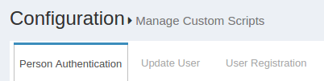
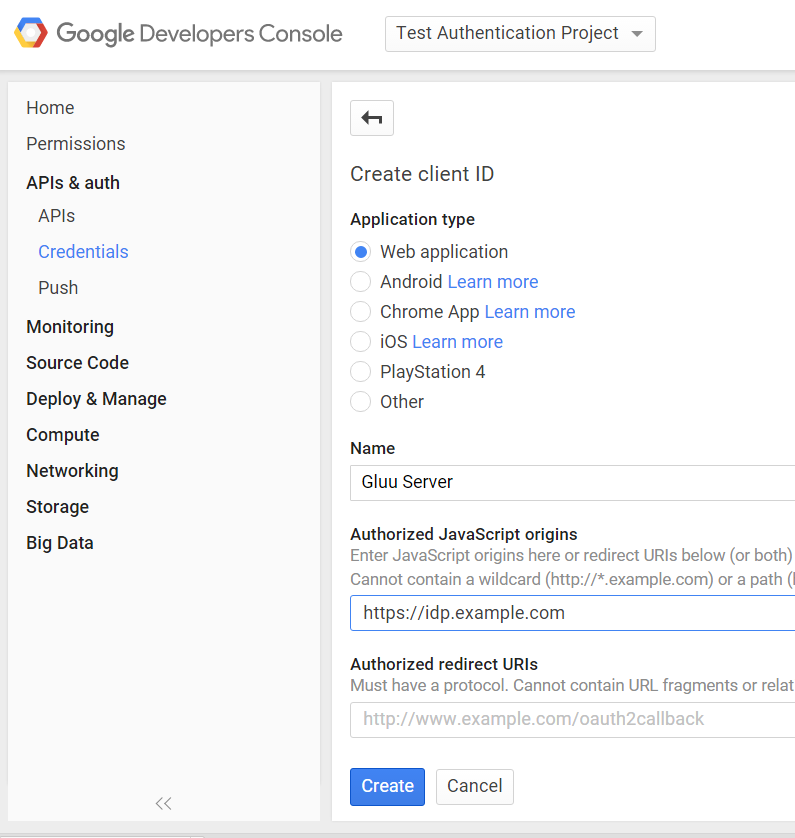

[TOC]
# Multi Factor Authentication
Using the  Gluu Server, you can define the business logic for complex multi-step authentication workflows, providing SSO for people using smart cards, tokens, mobile or biometric authentication mechanisms. You don't have to chose one multi-factor authentication technology. You can have multiple authentication mechanisms active at the same time--Web or mobile clients can request a certain authentication type by using standard OpenID Connect request parameters.

A number of multi-factor authentication scripts are shipped in the Gluu Server by default, including support for FIDO U2F tokens, Gluu's free mobile two-factor application [Super Gluu](https://super.gluu.org), certificate authentication, and Duo Security. 

# DUO Security
## Overview
There are a few properties in the [DUO][duo] Authentication Script.

|	Property	|Status		|	Description	|	Example		|
|-----------------------|---------------|-----------------------|-----------------------|
|duo_creds_file		|Mandatory     |Path to ikey, skey, akey|/etc/certs/duo_creds.json|
|duo_host		|Mandatory    |URL of the DUO API Server|api-random.duosecurity.com|
|audit_attribute	|Optional|Attribute to determine user group|memberOf		|
|duo_group		|Optional|Attribute to enable DUO for specific user|memberOf	|
|audit_group		|Optional|Notify administrator via email upon user login|memberOf|
|audit_group_email	|Optional|Administrator email		| admin@organization.com|

## Configure DUO Account
1. Sign up for a Duo account.

2. Log in to the Duo Admin Panel and navigate to Applications.

3. Click Protect an Application and locate Web SDK in the applications list. Click Protect this Application to get your integration key, secret key, and API hostname.

4. Generate an `akey` value for your instance. [Click here to know more ](https://duo.com/docs/duoweb#1.-generate-an-akey)

For additional info on Duo's Web SDK check [this atricle](https://duo.com/docs/duoweb) 

## Configure CE Chroot
1. Prepare the DUO credential file `/etc/certs/duo_creds.json` with **ikey, akey & skey**

## Configure oxTrust
Follow the steps below to configure the [DUO][duo] module in the oxTrust Admin GUI.

1. Go to Manage Custom Scripts<br/>


2. Scroll down to [DUO][duo] authentication script<br/>


3. Change the value of `duo_host` to your API

4. Enable the script by ticking the check box


5. Change the dufault authenticaiont method to [DUO][duo]


# U2F
This script enables multi-factor authentication with any FIDO U2F device. Learn more about the U2F standard [here](https://www.gluu.org/resources/documents/standards/fido-u2f/). For a list of U2F compliant devices for sale, [check Amazon](http://www.amazon.com/s/ref=nb_sb_noss?url=search-alias%3Daps&field-keywords=U2F). 

Some well known U2F device manufacturers include:  
- [Yubico](https://www.yubico.com/)   
- [HyperFIDO](http://hyperfido.com/)   
- [Feitian Technologies](http://www.ftsafe.com/)    

## Overview
The script has the following properties

|	Property	|	Description		|	Example	|
|-----------------------|-------------------------------|---------------|
|u2f_server_uri		|URL of the u2f server		|https://idp.gluu.info|
|u2f_server_metadata_uri|URL of the u2f server metadata|https://idp.gluu.info|

## Installation
### Configure oxTrust
Follow the steps below to configure the [DUO][duo] module in the oxTrust Admin GUI.

1. Go to Manage Custom Scripts


2. Click on the Person Authentication tab


3. Select the U2F script


4. Enable the script by ticking the check box


5. Click `Update`

6. Change the `Default Authentication Method` to `u2f`


#oxPush2
## Overview
The script has the following properties

|	Property	|	Description		|	Example	|
|-----------------------|-------------------------------|---------------|
|application_id		|URL of the identity server	|https://idp.gluu.info|
|authentication_mode	|Determine factor of authentication|two_step|
|credentials_file	|JSON file for oxPush2 		|/etc/certs/oxpush2_creds.json|

## Configure oxTrust

1. Go to Manage Custom Script


2. Click on the Perosn Authentication tab


3. Select the oxPush2 Script


4. Enable the script by ticking the check box


5. Click `Update`

6. Change the Authentication method to oxPush2


# Wikid Authentication
## Overview
The module has the following mandatory properties

|	Peoperty	|	Description			|	Example		|
|-----------------------|---------------------------------------|-----------------------|
|wikid_server_host	|IP address of WIKID server		|192.168.1.1		|
|wikid_server_port	|TCP port for WIKID serve		|[8388][default 8388]	|
|wikid_cert_path	|Path to the PKCS12 certificate file	|/etc/certs/wikid.p12	|
|wikid_cert_pass	|Passphrase for  PKCS12 file		|passphrase		|
|wikid_ca_store_path	|[CA][ca] for WAS server certificate	|/etc/certs/CACertStore.dat|
|wikid_ca_store_pass	|Passphrase to secure the CA store file	|passphrase		|
|wikid_server_code	|Server domain 12 digit code		|135711131719		|

## Installation
### Configure CE Chroot
The following libraries must be present in the `$TOMCAT_HOME/endorsed` folder.

- https://www.wikidsystems.com/webdemo/wClient-3.5.0.jar
- http://central.maven.org/maven2/org/jdom/jdom/1.1.3/jdom-1.1.3.jar
- http://central.maven.org/maven2/log4j/log4j/1.2.17/log4j-1.2.17.jar
- http://central.maven.org/maven2/com/thoughtworks/xstream/xstream/1.4.8/xstream-1.4.8.jar

For more informatiaon about the wClient Library, please see [this page](https://www.wikidsystems.com/downloads/network-clients)

### Token Client
Wikid Authentication requires [token client](https://www.wikidsystems.com/downloads/token-clients). Please install and configure it for 
first time use. The [demo](https://www.wikidsystems.com/demo) explains how to do that.

## Configure oxTrust
1. Go to `Manage Custom Scripts`


2. Click on the `Add custom script configuration` button


3. Fill up the form and add the [Wikid Authentication Script](https://raw.githubusercontent.com/GluuFederation/oxAuth/master/Server/integrations/wikid/WikidExternalAuthenticator.py)

4. Enable the script by ticking the check box


5. Change the `Default Authentication Method` to `wikid`


# Certificate Authentication
The image below contains the design diagram for this module.


The script has a few properties:

|       Property        |Description|   Allowed Values                  |example|
|-------|--------------|------------|-----------------|
|chain_cert_file_path   |mandatory property pointing to certificate chains in [pem][pem] format |file path| /etc/certs/chain_cert.pem   |
|map_user_cert          |specifies if the script should map new user to local account           |true/false| true|
|use_generic_validator  |enable/disable specific certificate validation                         |true/false| false|
|use_path_validator     |enable/disable specific certificate validation                         |true/false| true|
|use_oscp_validator|enable/disable specific certificate validation                              |true/false| false|
|use_crl_validator|enable/disable specific certificate validation                               |true/false| false|
|crl_max_response_size  |specifies the maximum allowed size of [CRL][crl] response              | Integer > 0| 2|

## Configure oxTrust
Follow the steps below to configure the certificate authentication in the oxTrust Admin GUI.

1. Go to Manage Custom Scripts


2. Click on the `Add Custom Scritp` button
[add-script-button](../img/admin-guide/multi-factor/add-script-button.png)

3. Fill up the from and add the [Certificate Authentication Script](https://raw.githubusercontent.com/GluuFederation/oxAuth/master/Server/integrations/cert/UserCertExternalAuthenticator.py)

4. Enable the script by ticking the check box
[enable](../img/admin-guide/enable.png)

5. Change the `Default Authentication Method` to `Cert`


# Configure Google

In order to call Google API's, you need to register as a developer and
create client credentials. Here are some
[instructions](https://developers.google.com/identity/protocols/OAuth2)
for these steps.

The first thing you'll need to do is Create a Project on Google to obtain
client credentials. Click "Create project" and enter your desired
project name.


Then click on your newly created project from the listing on the
dashboard, and under the Credentials section, create a new "OAuth2 2.0
client ID". 


Google will ask you to configure your consent screen, to add your logo
and other information displayed to the user to authorize Google to
release information.


Fill out the form...


Now you're ready to create the credentials. Enter "Authorized JavaScript
origins". It should be the uri of your Gluu Server--for example
`https://idp.example.com`.



Google will display the client-id and the according secret ... ignore
it. Instead, download the JSON file which you are going to upload into
your Gluu Server, next.


Move this file to the location `/opt/tomcat/conf/google.json`. The JSON
file will look something like this example (no... these data are not
valid credentials!):

```
{
  "web": {
    "client_id": "7a64e55f-724d4e8c91823d5f1f18a0b2.apps.googleusercontent.com",
    "auth_uri": "https:\/\/accounts.google.com\/o\/oauth2\/auth",
    "token_uri": "https:\/\/accounts.google.com\/o\/oauth2\/token",
    "auth_provider_x509_cert_url": "https:\/\/www.googleapis.com\/oauth2\/v1\/certs",
    "client_secret": "bb76a2c99be94e35b874",
    "javascript_origins": [
    "https:\/\/brookie.gluu.info"
    ]
  }
}
```

The last step is to enable Google+ API's:

- Navigate back to the Google API [console](https://console.developers.google.com/project)
- Select project and enter project name
- Open new project "API & auth -> API" menu item in configuration navigation tree
- Click "Google+ API"
- Click "Enable API" button

## Configure oxTrust
Follow the steps below to configure the certificate authentication in the oxTrust Admin GUI.

1. Go to Manage Custom Scripts


2. Click on the `Add Custom Scritp` button
[add-script-button](../img/admin-guide/multi-factor/add-script-button.png)

3. Fill up the form and add the [Google External Authenticator](https://raw.githubusercontent.com/GluuFederation/oxAuth/master/Server/integrations/gplus/GooglePlusExternalAuthenticator.py) Script.

You'll also need to add some custom properties:

 * __gplus_client_secrets_file__: `/opt/tomcat/conf/google.json`
 * __gplus_deployment_type__: enroll
 * __gplus_remote_attributes_list__: email, given_name, family_name, and locale
 * __gplus_local_attributes_list__: uid, mail, givenName, sn, cn, preferredLanguage

1. __gplus_client_secrets_file__ - It is a mandatory property that holds
   the path to the application configuration file downloaded from Google
   console for application. An example is `/etc/certs/gplus_client_secrets.json`.
   These are the single steps needed to get it:
    a) Log into: `https://console.developers.google.com/project`
    b) Click "Create project" and enter project name
    c) Open new project "API & auth -> Credentials" menu item in configuration navigation tree
    d) Click "Add credential" with type "OAuth 2.0 client ID"
    e) Select "Web application" application type
    f) Enter "Authorized JavaScript origins". It should be CE server DNS
       name, for example `https://gluu.info`.
    g) Click "Create" and Click "OK" in next dialog
    h) Click "Download JSON" in order to download
       `gplus_client_secrets.json` file.
    Also it is mandatory to enable Google+ API:
    a) Log into `https://console.developers.google.com/project`
    b) Select project and enter project name
    c) Open new project "API & auth -> API" menu item in configuration navigation tree
    d) Click "Google+ API"
    e) Click "Enable API" button

2. __gplus_deployment_type__ - Specify the deployment mode. It is an
optional property. If this property isn't specified the script tries to
find the user in the local LDAP by 'subject_identifier' claim specified
in id_token. If this property has a 'map' value the script allows to map
'subject_identifier' to the local user account. If this property has an
'enroll' value the script adds a new user to the local LDAP with status
'active'. In order to map the IDP attributes to the local attributes it
uses properties from both gplus_remote_attributes_list and
gplus_local_attributes_list. The allowed values are map and enroll.

3. __gplus_remote_attributes_list__ - Comma-separated list of attribute
names (user claims) that Google+ returns which map to local attributes
in the `gplus_local_attributes_list` property. It is mandatory only if
`gplus_deployment_type` is set to 'enroll'.

4. __gplus_local_attributes_list__ - Comma-separated list of Gluu Server
LDAP attribute names that are mapped to Google user claims from the
`gplus_remote_attributes_list` property. It is mandatory only if
`gplus_deployment_type` is set to 'enroll'.

5. __extension_module__ - Optional property to specify the full path of
an external module that implements two methods:

```python
    # This is called when the authentication script initializes
    def init(conf_attr):
        # Code here
        return True/False

    # This is called after authentication
    def postLogin(conf_attr, user):
        # Code here
        return True    # or return False
```

6. __gplus_client_configuration_attribute__ - Optional property to
specify the client entry attribute name which can override
`gplus_client_secrets_file file` content. It can be used in cases when
all clients should use a separate `gplus_client_secrets.json`
configuration.


## Testing

One simple way to test the configuration is to use oxTrust. In the
"Configure Authentication" dropdown menu, select "Google" (or whatever
you entered as the "Name" of the custom authentication script--as the
default authentication method.


After you login and logout, you should be presented with a new login
form that has the Google login button:


After clicking the Google login button, you are presented for
authorization--Google needs to make sure its ok to release attributes to
the Gluu Server:


If the script doesn't work, and you locked yourself out of oxTrust,
don't worry! You can create an LDIF file, for example `revert.ldif`, to
set back the default authentication method, like this:

```
dn: inum=@!1E3B.F133.14FA.5062!0002!4B66.CF9C,ou=appliances,o=gluu
changetype: modify
replace: oxAuthenticationMode
oxAuthenticationMode: internal
```

oxAuthenticationMode corresponds to the 'Name' of the customer
authentication script in oxTrust. Use `internal` to revert to the
default LDAP authentication. You'll have to change the `inum` with the
`inum` of your installation. You can find it using ldapsearch like this:

```
/opt/opendj/bin/ldapsearch -h localhost -p 1389 -D "cn=directory manager" -j ~/.pw -b "ou=appliances,o=gluu" -s one "objectclass=*" inum
```

`~/.pw` is a file with your Directory Manager password. If you don't
remember it, try to find it using `grep`: 

```
grep ldapPass= /install/community-edition-setup/setup.properties.last
```

Once your LDIF looks ok, then use `ldapmodify` to revert back to
password authentication:

```
/opt/opendj/bin/ldapmodify -h localhost -p 1389 -D "cn=directory manager" -j ~/.pw -f revert.ldif
```

If things go wrong, it can leave the sessions in your browser in a bad
state. If things get really weird, remove the cookies in your browser
for the hostname of your Gluu Server.


