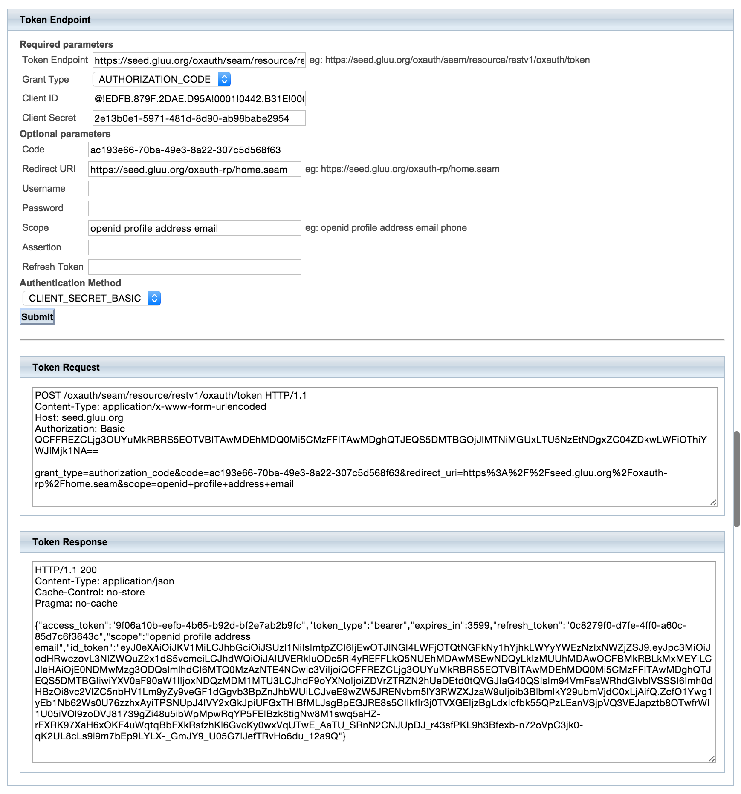
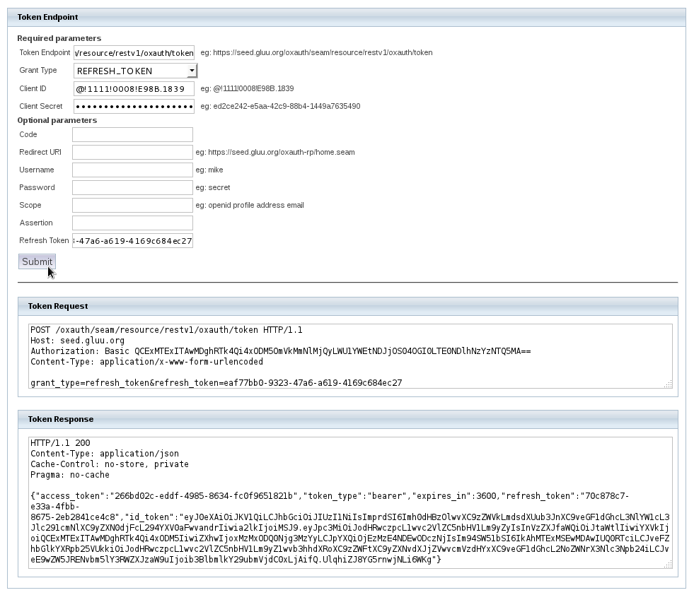

# Overview
OpenID Connect is an authentication layer built on OAuth 2.0. 
OpenID Connect is a specific implementation of OAuth 2.0 
where the identity provider holds protected resources that a 
third-party application needs to access on behalf of a person. 
OpenID Connect allows relying parties to verify the identity of, and obtain information about a person requesting to access the applications protected resources. 


# Jargon
In OpenID Connect the key entities include:

- The *end user* (a.k.a. OAuth 2.0 resource owner) whose user information the application needs to access.

The end user wants to login to an application using an existing account at an OpenID Connect identity provider (OP).

- The *Relying Party (RP)* (a.k.a. OAuth 2.0 client) needs access to the end user's protected user information.

For example, an online chat application needs to know who is accessing the application in order to present the correct user account and contacts. 

- The *OpenID Provider (OP)* (a.k.a. OAuth 2.0 authorization server and also resource server) that holds the user information and grants access.

The Gluu Server is an OpenID Provider. The OP holds information about the user and allows the end user or the organization (depending on configuration) to consent to providing the RP with access to user information. OpenID Connect defines a unique identification for an account (subject identifier + issuer identifier), and the RP can use this as a key to its own user profile. 

The relying party can verify claims about the identity of the end user, and log the user out at the end of a session. OpenID Connect also makes it possible to discover the OpenID Provider for an end user, and to register relying party client applications dynamically. OpenID connect services are built on OAuth 2.0, JSON Web Token (JWT), WebFinger and Well-Known URIs.

# OpenID Connect Support in the Gluu Server
The Gluu Server is a [fully certified OpenID Connect Provider (OP)](http://openid.net/certification/). As an OpenID Provider, the Gluu Server enables OpenID Connect relying parties (clients) to discover its capabilities, handle both dynamic and static registration of relying parties, respond to relying party requests with authorization codes, access tokens, and user information according to the Authorization Code and Implicit flows of OpenID Connect, and manages sessions.

## OpenID Connect Authorization Code Flow
The OpenID Connect Authorization Code Flow specifies how the relying party interacts with the OpenID Provider based on use of the OAuth 2.0 authorization grant. 

## OpenID Connect Implicit Flow
The OpenID Connect Implicit Flow specifies how the relying party interacts with the OpenID Provider based on use of the OAuth 2.0 implicit grant. 

## Discovery 

The first thing you want to know about any OAuth 2.0 API is where the
endpoints are (i.e. what are the URIs where you call the APIs).
OpenID Connect provides a very simple mechanism to accomplish this: 
[OpenID Connect Discovery](http://openid.net/specs/openid-connect-discovery-1_0.html).

In order for an OpenID Connect Relying Party to utilize OpenID Connect
services for an End-User, the RP needs to know where the OpenID Provider is.
OpenID Connect uses [WebFinger](http://en.wikipedia.org/wiki/WebFinger)
to locate the OpenID Provider for an End-User.

Once the OpenID Provider has been identified, the configuration information
for the OP is retrieved from a well-known location as a JSON document,
including its OAuth 2.0 endpoint locations.

### Sample Discovery Request
If you want to try a discovery request, you can make the following
WebFinger request to discover the Issuer location:

```
GET /.well-known/webfinger?resource=https%3A%2F%2Fidp.gluu.org&rel=http%3A%2F%2Fopenid.net%2Fspecs%2Fconnect%2F1.0%2Fissuer HTTP/1.1
Host: idp.gluu.org

HTTP/1.1 200
Content-Type: application/jrd+json

{
    "subject": "https://idp.gluu.org",
    "links": [{
        "rel": "http://openid.net/specs/connect/1.0/issuer",
        "href": "https://idp.gluu.org"
    }]
}
```

Using the Issuer location discovered, the OpenID Provider's configuration information can be retrieved.

The RP makes the following request to the Issuer `https://<domain>/.well-known/openid-configuration` to obtain its
Configuration information:

```
GET /.well-known/openid-configuration HTTP/1.1
Host: idp.gluu.org

HTTP/1.1 200
Content-Type: application/json

{
    "issuer": "https://idp.gluu.org",
    "authorization_endpoint": "https://idp.gluu.org/oxauth/seam/resource/restv1/oxauth/authorize",
    "token_endpoint": "https://idp.gluu.org/oxauth/seam/resource/restv1/oxauth/token",
    "userinfo_endpoint": "https://idp.gluu.org/oxauth/seam/resource/restv1/oxauth/userinfo",
    "clientinfo_endpoint": "https://idp.gluu.org/oxauth/seam/resource/restv1/oxauth/clientinfo",
    "check_session_iframe": "https://idp.gluu.org/oxauth/opiframe",
    "end_session_endpoint": "https://idp.gluu.org/oxauth/seam/resource/restv1/oxauth/end_session",
    "jwks_uri": "https://idp.gluu.org/oxauth/seam/resource/restv1/oxauth/jwks",
    "registration_endpoint": "https://idp.gluu.org/oxauth/seam/resource/restv1/oxauth/register",
    "validate_token_endpoint": "https://idp.gluu.org/oxauth/seam/resource/restv1/oxauth/validate",
    "federation_metadata_endpoint": "https://idp.gluu.org/oxauth/seam/resource/restv1/oxauth/federationmetadata",
    "federation_endpoint": "https://idp.gluu.org/oxauth/seam/resource/restv1/oxauth/federation",
    "id_generation_endpoint": "https://idp.gluu.org/oxauth/seam/resource/restv1/id",
    "introspection_endpoint": "https://idp.gluu.org/oxauth/seam/resource/restv1/introspection",
    "scopes_supported": [
        "clientinfo",
        "email",
        "openid",
        "profile",
        "address",
        "uma_protection",
        "user_name",
        "uma_authorization",
        "mobile_phone",
        "phone"
    ],
    "response_types_supported": [
        "code",
        "code id_token",
        "token",
        "token id_token",
        "code token",
        "code token id_token",
        "id_token"
    ],
    "grant_types_supported": [
        "authorization_code",
        "implicit",
        "urn:ietf:params:oauth:grant-type:jwt-bearer"
    ],
    "acr_values_supported": [""u2f", "duo", "basic", "mt", "oxpush2", "gplus", "internal"],
    "auth_level_mapping": {"-1": [["internal"]]},
    "subject_types_supported": [
        "public",
        "pairwise"
    ],
    "userinfo_signing_alg_values_supported": [
        "HS256", "HS384", "HS512",
        "RS256", "RS384", "RS512",
        "ES256", "ES384", "ES512"
    ],
    "userinfo_encryption_alg_values_supported": [
        "RSA1_5", "RSA-OAEP",
        "A128KW", "A256KW"
    ],
    "userinfo_encryption_enc_values_supported": [
        "RSA1_5", "RSA-OAEP",
        "A128KW", "A256KW"
    ],
    "id_token_signing_alg_values_supported": [
        "HS256", "HS384", "HS512",
        "RS256", "RS384", "RS512",
        "ES256", "ES384", "ES512"
    ],
    "id_token_encryption_alg_values_supported": [
        "RSA1_5", "RSA-OAEP",
        "A128KW", "A256KW"
    ],
    "id_token_encryption_enc_values_supported": [
        "A128CBC+HS256", "A256CBC+HS512",
        "A128GCM", "A256GCM"
    ],
    "request_object_signing_alg_values_supported": [
        "none",
        "HS256", "HS384", "HS512",
        "RS256", "RS384", "RS512",
        "ES256", "ES384", "ES512"
    ],
    "request_object_encryption_alg_values_supported": [
        "RSA1_5", "RSA-OAEP",
        "A128KW", "A256KW"
    ],
    "request_object_encryption_enc_values_supported": [
        "A128CBC+HS256", "A256CBC+HS512",
        "A128GCM", "A256GCM"
    ],
    "token_endpoint_auth_methods_supported": [
        "client_secret_basic",
        "client_secret_post",
        "client_secret_jwt",
        "private_key_jwt"
    ],
    "token_endpoint_auth_signing_alg_values_supported": [
        "HS256", "HS384", "HS512",
        "RS256", "RS384", "RS512",
        "ES256", "ES384", "ES512"
    ],
    "display_values_supported": [
        "page",
        "popup"
    ],
    "claim_types_supported": ["normal"],
    "claims_supported": [
        "birthdate",
        "country",
        "name",
        "email",
        "email_verified",
        "given_name",
        "gender",
        "inum",
        "family_name",
        "updated_at",
        "locale",
        "middle_name",
        "nickname",
        "phone_number_verified",
        "picture",
        "preferred_username",
        "profile",
        "zoneinfo",
        "user_name",
        "website"
    ],
    "service_documentation": "http://gluu.org/docs",
    "claims_locales_supported": ["en"],
    "ui_locales_supported": [
        "en", "es"
    ],
    "scope_to_claims_mapping": [
        {"clientinfo": [
            "name",
            "inum"
        ]},
        {"email": [
            "email_verified",
            "email"
        ]},
        {"openid": ["inum"]},
        {"profile": [
            "name",
            "family_name",
            "given_name",
            "middle_name",
            "nickname",
            "preferred_username",
            "profile",
            "picture",
            "website",
            "gender",
            "birthdate",
            "zoneinfo",
            "locale",
            "updated_at"
        ]},
        {"address": [
            "formatted",
            "postal_code",
            "street_address",
            "locality",
            "country",
            "region"
        ]},
        {"uma_protection": []},
        {"user_name": ["user_name"]},
        {"uma_authorization": []},
        {"mobile_phone": ["phone_mobile_number"]},
        {"phone": [
            "phone_number_verified",
            "phone_number"
        ]}
    ],
    "claims_parameter_supported": true,
    "request_parameter_supported": true,
    "request_uri_parameter_supported": true,
    "require_request_uri_registration": false,
    "op_policy_uri": "http://ox.gluu.org/doku.php?id=oxauth:policy",
    "op_tos_uri": "http://ox.gluu.org/doku.php?id=oxauth:tos",
    "http_logout_supported": "true",
    "logout_session_supported": "true"
}
```

The following is an example using the [oxAuth-Client](https://ox.gluu.org/maven/org/xdi/oxauth-client/) lib:

```
String resource = "acct:mike@idp.gluu.org";

OpenIdConnectDiscoveryClient openIdConnectDiscoveryClient = new OpenIdConnectDiscoveryClient(resource);
OpenIdConnectDiscoveryResponse openIdConnectDiscoveryResponse = openIdConnectDiscoveryClient.exec();

.....

OpenIdConfigurationClient client = new OpenIdConfigurationClient(configurationEndpoint);
OpenIdConfigurationResponse response = client.execOpenIdConfiguration();
```

See [org.xdi.oxauth.ws.rs.ConfigurationRestWebServiceHttpTest](https://github.com/GluuFederation/oxAuth/blob/master/Client/src/test/java/org/xdi/oxauth/ws/rs/ConfigurationRestWebServiceHttpTest.java)

### Algorithm
oxAuth supports various types of signature and encryption
algorithms for authorizing request parameter passing, ID token signature
and encryption, signing return responses, Encrypt User Info Endpoints
etc.

**Note:** It is a good practice to implement ID Token Signatures with the RSA
SHA-256 algorithm (algorithm value RS256). Additionally, oxAuth also
supports other algorithms that are listed below.

_Available Signature Algorithms:_ none, HS256, HS384, HS512, RS256, RS384, RS512, ES256, ES384, ES512.

_Encryption, Key Encryption Algorithms:_ RSA1_5, RSA-OAEP, A128KW, A256KW.

_Block Encryption Algorithms:_ A128CBC+HS256, A256CBC+HS612, A128GCM, A256GCM,

## OpenID Connect Relying Party Registration
Relying parties can register with the Gluu Server both statically, by the Gluu Server admin, and dynamically, as specified by OpenID Connect Discovery. To allow dynamic registration, you register an initial OAuth 2.0 client that other relying parties can use to get access tokens for registration. You can also enable OpenID Connect relying parties to register dynamically without having to provide an access token. If dynamic registration is enabled, make sure to limit or throttle registrations as it could be used as a form of DDOS.

## Session management

OpenID Connect lets the relying party track whether the end user is logged in at the provider, and also initiate end user logout at the provider. The specification has the relying party monitor session state using an invisible iframe and communicate status using the HTML 5 postMessage API.

However, be forewarned that there is no perfect answer to logout that
satisfies all requirements for all domains on the Internet. For
example, large OpenID Providers, like Google, need a totally stateless
implementation--Google cannot track sessions on the server side for
every browser on the Internet. But in smaller domains, server side
logout functionality can be a convenient solution to cleaning up
resources.

The OpenID Connect [Session
Management](http://openid.net/specs/openid-connect-session-1_0.html) is
still marked as draft, and new mechanisms for logout are in the works.
The current specification requires JavaScript to detect that the session
has been ended in the browser. It works... unless the tab with the
JavaScript happens to be closed when the logout event happens on another
tab. Also, inserting JavaScript into every page is not feasible for some
applications. A new proposal is under discussion where the OpenID
Connect logout API would return `IMG` HTML tags to the browser with the
logout callbacks of the clients. This way, the browser could call the
logout uris (not the server).

The Gluu Server is very flexible, and supports both server side session
management, and stateless session management. For server side
logout, the domain admin can use [Custom Logout scripts](./custom-script.md#application-session-management). This can be
useful to clean up sessions in a legacy SSO system (i.e. SiteMinder), or
perhaps in a portal.

The key for logout is to understand the limitations of logout, and to
test the use cases that are important to you, so you will not be
surprised by the behavior when you put your application into production.

## Testing with oxAuth RP

  - Go to https://seed.gluu.org/oxauth-rp
  - Or deploy `oxAuth-rp.war`

### Authorization Endpoint

#### Request Authorization and receive the Authorization Code and ID Token

  - Go to https://seed.gluu.org/oxauth-rp
  - Enter the Authorization Endpoint (eg: https://seed.gluu.org/oxauth/seam/resource/restv1/oxauth/authorize)
  - Select the Response Types: CODE and ID_TOKEN
  - Enter the Client ID (eg: @!EDFB.879F.2DAE.D95A!0001!0442.B31E!0008!A2DA.C10F)
  - Select the desired scopes: OpenID is mandatory, profile, address,
    email and phone are optional.
  - Enter a Redirect uri, e.g. https://seed.gluu.org/oxauth-rp/home.seam
  - Optionally enter a state value.
  - Click submit.


#### Request Access Token using the Authorization Code

  - Once redirected back to https://seed.gluu.org/oxauth-rp
  - Enter the Token Endpoint (eg: https://seed.gluu.org/oxauth/seam/resource/restv1/oxauth/token)
  - Select the Grant Type: AUTHORIZATION_CODE
  - Enter the Client ID.
  - Enter the Client Secret.
  - Enter the Code received from the previous request
  - Enter the Redirect uri, e.g. https://seed.gluu.org/oxauth-rp/home.seam
  - Enter the scopes: OpenID profile address email phone.
  - Click submit.



#### Request new Access Token using the Refresh Token

  - Go to https://seed.gluu.org/oxauth-rp
  - Enter the Token Endpoint (https://seed.gluu.org/oxauth/seam/resource/restv1/oxauth/token)
  - Select the Grant Type: REFRESH_TOKEN
  - Enter the Client ID.
  - Enter the Client Secret.
  - Enter the Refresh Token received in a previous request.
  - Click submit.




### UserInfo Endpoint


### OpenID Connect Session Management

#### End Session Endpoint


#### Check Session iFrame


# Implementing OpenID Connect in your application

Use [oxd](https://oxd.gluu.org). 